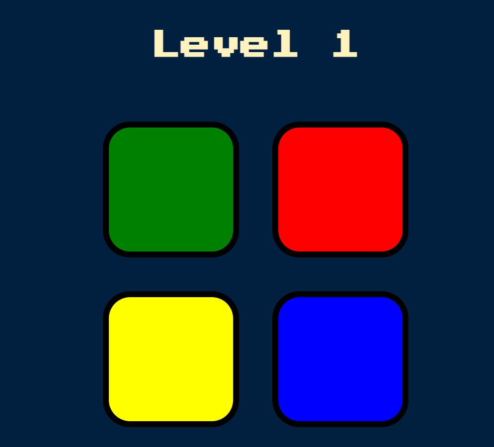

# Simon Game Project

This is a simple Simon game project built using HTML, CSS, and JavaScript. The game challenges players to replicate increasingly complex sequences of lights and sounds.

## User Interface
The game interface is created using HTML to structure the content and CSS for styling. It typically includes a large circular board divided into four quadrants of different colors (red, blue, green, yellow), which light up and produce sounds when activated. Buttons for starting the game, restarting, and possibly adjusting difficulty levels are also included.

## Game Logic
JavaScript is used to implement the core functionality of the game. This includes generating random sequences of lights and sounds that the player must replicate, handling user input, and determining whether the player's input matches the sequence. The game progresses by adding one more element to the sequence each round, increasing the difficulty.

## Event Handling
Event listeners are set up in JavaScript to detect user interactions, such as clicks on the colored quadrants. When a user clicks a quadrant, the corresponding sound and light effects are triggered, and the user's input is compared against the generated sequence. Feedback is provided to the player based on whether their input is correct or incorrect.

## Feedback and Progression
Visual and auditory feedback is crucial in a Simon game. CSS transitions and animations are used to create smooth lighting effects on the quadrants, while JavaScript handles playing corresponding sound clips. The game also keeps track of the current level of the player and provides feedback for correct and incorrect moves.

## How to Play
1. Press the start button to begin the game.
2. Watch the sequence of lights and sounds.
3. Repeat the sequence by clicking the quadrants in the correct order.
4. Each round, a new element is added to the sequence.
5. Try to remember and replicate the sequence as it grows longer.
6. The game ends if you click the wrong quadrant.

## Technologies Used
- HTML
- CSS
- JavaScript

## Screenshots

